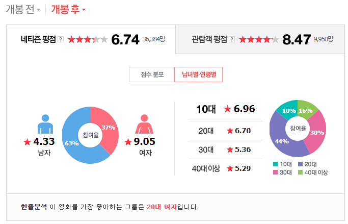

## 주제 선정
영화 '캡틴마블'의 네이버 영화 리뷰란을 분석해보기로 하였다. <br/>
[캡틴 마블:네이버 영화](https://movie.naver.com/movie/bi/mi/basic.nhn?code=132623#tab) <br/>
위 링크의 HTML 파일을 분석하여 리뷰란은 iframe 태그로 작성되어있었고, Python을 이용하여 1000개의 페이지를 크롤링하였다.

## 분석과정

### 크롤링
파이썬으로 웹페이지를 크롤링하였다. <br/>
파이썬 소스[](https://github.com/imgeum/python-crawling/blob/master/naver-movie-comment/main.py) <br/>
div class="score_reple", p 태그가 댓글, em 태그 중 작성날짜가 나와있다.

### 데이터 처리
데이터 처리는 R을 사용하였다. KoNLP를 사용하여 데이터를 분석하였다. <br/>
<br/>
사용한 라이브러리는 다음과 같다.
```{r}
library(KoNLP)
library(stringr)
library(dplyr)
library(wordcloud2)

useSejongDic()
```

데이터 전처리
```{r}
comment_datas <- read.csv("data/movie_comment.csv", header = T, fileEncoding="UTF-8")
comment_df <- comment_datas %>% select('cmt')

comment_str <- toString(comment_df)
comment_list <- as.list(comment_df)

comment_str <- paste(unlist(comment_list$cmt), collapse='')

words <- sapply(comment_str, extractNoun, USE.NAMES = F)

words_filtered <- Filter(function(x) {nchar(x) <= 15}, words)
words_filtered <- str_replace_all(words_filtered, "[^[:alpha:]]", "")  # 한글, 영어외는 삭제

words_filtered <- gsub("영화", "", words_filtered)
words_filtered <- gsub("관람객", "", words_filtered)
words_filtered <- gsub("점", "", words_filtered)
words_filtered <- gsub("것", "", words_filtered)
words_filtered <- gsub("이", "", words_filtered)
words_filtered <- gsub("점", "", words_filtered)
words_filtered <- gsub("들", "", words_filtered)
words_filtered <- gsub("듯", "", words_filtered)
words_filtered <- gsub("평", "", words_filtered)
words_filtered <- gsub("한", "", words_filtered)
words_filtered <- gsub("수", "", words_filtered)
words_filtered <- gsub("중", "", words_filtered)
words_filtered <- gsub("만", "", words_filtered)
words_filtered <- gsub("나", "", words_filtered)
words_filtered <- gsub("별", "", words_filtered) 
words_filtered <- gsub("데", "", words_filtered) 
words_filtered <- gsub("뭐", "", words_filtered) 
words_filtered <- gsub(" ", "", words_filtered) 

write(unlist(words_filtered),"data/filtered_comment.txt") 
read_filtered_words <- read.table("data/filtered_comment.txt")
table_words <- table(read_filtered_words)
```

데이터 전처리를 거쳐 나온 단어의 수는 15701 개이다.
```{r}
nrow(table_words)
```

#### wordcloud
최신 패키지인 wordcloud2를 이용하여 리뷰 중 가장 빈도수가 높은 50개의 단어를 wordcloud를 제작하였다.
```{r}
wordcount <- head(sort(table_words,decreasing=T), 30)
wordcloud2(wordcount)
```

## 분석 I

#### 단어 빈도수 1 ~ 15 위
```{r}
library(ggplot2)

df <- as.data.frame(wordcount)

ggplot(data=head(df, 15), aes(x=read_filtered_words, y=Freq)) + 
    geom_bar(stat='identity') + 
    geom_text(aes(label=Freq), vjust=-0.3, size=3.5)
```

#### 단어 빈도수 16 ~ 30 위
```{r}
ggplot(data=tail(df, 15), aes(x=read_filtered_words, y=Freq)) + 
    geom_bar(stat='identity') + 
    geom_text(aes(label=Freq), vjust=-0.3, size=3.5)
```

## 분석 II
이번 분석에서 사용한 데이터는 댓글과 작성시간으로 구분할 수 있다. <br/>
하지만 네이버 영화의 댓글 그래프를 보면 성별과 연령, 댓글 작성시간이라는 데이터가 있다. <br/>
 <br/>
위 데이터를 추출하지 못하였지만 네이버 영화 댓글 그래프를 통하여 영화 '캡틴 마블'의 의미를 분석하였다. <br/>


## 결론

## 데이터 분석 개선점

### 데이터

#### 네이버 영화 리뷰
네이버 영화 리뷰의 데이터는 평점/리뷰/공감/비공감/날짜 등으로 구성되어있는데, 이 보고서에서 사용한 데이터는 평점뿐이다. <br/>
또한 관람객이 아닌 비관람객 또한 리뷰를 달 수 있으며, 공감/비공감을 할 수 있는 등 데이터가 비관람객과 관람객의 비중을 알 수 없다. <br/>
마블의 첫 여성 주인공 영화인 만큼 남녀 호불호가 많이 갈리는 모습을 그래프를 통해 확인할 수 있는데, 실제 데이터로는 구할 수 없었다.
리뷰 작성자의 성별을 알 수 있었으면 더 명시적인 결론이 나왔을 것이다.

#### 다른 데이터
네이버 영화 리뷰는 2019년 7월 9일 기준 약 36,000건인 반면에 CGV의 평가 관람객 수는 약 110,000명으로 3배 넘게 차이나는 모습을 볼 수 있다.
여러 사이트의 리뷰를 기준으로 하여 분석할 수 있을 것이다.

### 통계
위의 데이터로 통계와 데이터 과학에 관련된 분석은 하지 못했다.

### 소스코드

#### 크롤링
웹페이지의 소스 분석을 통해 리뷰가 저장된 서버에서 주요 데이터만 갖고오는 방법을 통해 효율적인 크롤링할 수 있다. <br/>
http get 요청을 batch 처리하여 효율적인 데이터 처리를 할 수 있다.

#### 데이터 분석
R을 사용하였고 R과 utf-8의 인코딩 문제로 시간을 버렸는데, Python의 데이터 분석을 보면 가독성도 좋고 디버깅과 프로젝트 관리가 더 쉬울 것이다.

#### wordcloud
wordcloud와 r 파일 인코딩 때문에 코드의 품질이 떨어지고 삽질도 많이 했다. <br/>
특히 wordcloud2 패키지의 이미지의 모양대로 wordcloud를 그려주는 기능을 사용하려 하였으나 함수의 문제로 사용하지 못하였다. <br/>
python의 wordloud 오픈소스 패키지를 사용하면 인상깊은 wordcloud를 제작하여 보다 효과적인 보고서를 작성할 수 있을 것이다.
