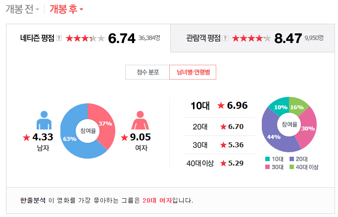

## 주제선정
영화 '캡틴마블'의 네이버 영화 리뷰란을 분석해보기로 하였다.
[캡틴 마블:네이버 영화](https://movie.naver.com/movie/bi/mi/basic.nhn?code=132623#tab)
위 링크의 HTML 파일을 분석하여 리뷰란은 <iframe> 태그로 작성되어있었고, Python을 이용하여 1000개의 페이지를 크롤링하였다.

##크롤링
파이썬으로 웹페이지를 크롤링하였음음
파이썬 소스[](https://github.com/imgeum/python-crawling/blob/master/naver-movie-comment/main.py)
<div class="score_reple"> <p> 태그가 댓글, <em>태그 중 작성날짜가 나와있다.
소스 분석을 통해 리뷰가 저장된 서버에서 댓글만을 갖고오거나, batch처리를 사용하여 크롤링 시간을 효율적으로 단축시킬 수 있을 것이다.

##데이터 처리
데이터 처리는 R을 사용하였다. KoNLP를 사용하여 데이터를 분석하였다.

```{r, echo=FALSE}

require(devtools)
install_github("lchiffon/wordcloud2")
library(wordcloud2)

library(RColorBrewer)
library(KoNLP)
library(stringr)
library(dplyr)

library(reshape2)
library(data.table)

useSejongDic()
```

```{r, echo=FALSE}
comment_datas <- read.csv("data/movie_comment.csv", header = T, fileEncoding="UTF-8")
comment_df <- comment_datas %>% select('cmt')

comment_str <- toString(comment_df)
comment_list <- as.list(comment_df)

comment_str <- paste(unlist(comment_list$cmt), collapse='')

words <- sapply(comment_str, extractNoun, USE.NAMES = F)

words_filtered <- Filter(function(x) {nchar(x) <= 15}, words)
words_filtered <- str_replace_all(words_filtered, "[^[:alpha:]]", "")  # 한글, 영어외는 삭제

words_filtered <- gsub("영화", "", words_filtered)
words_filtered <- gsub("관람객", "", words_filtered)
words_filtered <- gsub("점", "", words_filtered)
words_filtered <- gsub("것", "", words_filtered)
words_filtered <- gsub("이", "", words_filtered)
words_filtered <- gsub("점", "", words_filtered)
words_filtered <- gsub("들", "", words_filtered)
words_filtered <- gsub("듯", "", words_filtered)
words_filtered <- gsub("평", "", words_filtered)
words_filtered <- gsub("한", "", words_filtered)
words_filtered <- gsub("수", "", words_filtered)
words_filtered <- gsub("중", "", words_filtered)
words_filtered <- gsub("만", "", words_filtered)
words_filtered <- gsub("나", "", words_filtered)
words_filtered <- gsub("별", "", words_filtered) 
words_filtered <- gsub("데", "", words_filtered) 
words_filtered <- gsub("뭐", "", words_filtered) 
words_filtered <- gsub(" ", "", words_filtered) 

write(unlist(words_filtered),"data/filtered_comment.txt") 
read_filtered_words <- read.table("data/filtered_comment.txt")
table_words <- table(read_filtered_words)
```

#### 단어의 개수
데이터 전처리를 거쳐 나온 단어의 수는 15868 개이다.
```{r}
nrow(table_words)
```

#### wordcloud
최신 패키지인 wordcloud2를 이용하여 리뷰 중 가장 빈도수가 높은 50개의 단어를 wordcloud를 제작하였다.
```{r}
wordcount <- head(sort(table_words,decreasing=T), 50)
wordcloud2(wordcount)
```
 
## 분석 I
wordcloud의 주요 내용은 다음과 같다.
top 10개
1. 마블 1403
2. 재미 930
3. 진짜 661
4. 엔드 468
5. 스토리 451
6. 생각 419
7. 액션 402
8. 기대 397
9. 지루 390
10. 캡틴마블 373

1. 캡틴마블 스토리 관련 키워드
    1. '마블' - 1403개
    2. '캡틴' 
    2. '캡틴마블' - 373개
    4. '고양'
    5. 
2. 반응 관련 키워드
    1. 긍정
        1. '최고' - 297개
        2. '재밌게' - 293개
        3. 'ㅋㅋㅋ' - 125개
        4. '매력' - 131개
        5. 재밌어요
    2. 부정
        1. '최악'
        2. '노잼'
        3. '지루'
        4. '실망'
    3. 기타
        1. '완전'
        2. '역대'
        3. '연기'
        4. '진짜' 661
2. '여성' 관련 키워드
    1. '페미' - 304개
    2. '페미니즘' - 150개
    3. '여자' - 260개
    4. '남자'
3. 영화 관련 키워드
    1. '브리라슨'
    2. '캐스팅'
    3. '쿠키'
    4. '엔드'
    5. '배우'
    6. '캐스팅'
    7. 주인공
    8. 시리즈
    9. 영상
    10. 연기
    11. 내용
    12. 시간
    13. 마블은

5. 기타 키워드
    1. '생각' - 419개
    2. '정도'
    3. '사람'
    4. 자체
    5. 내용
    6. 시간


## 분석 II
이번 분석에서 사용한 데이터는 댓글과 작성시간으로 구분할 수 있다.
하지만 네이버 영화의 댓글 그래프를 보면 성별과 연령, 댓글 작성시간이라는 데이터가 있다.

위 데이터를 추출하지 못하였지만 네이버 영화 댓글 그래프를 통하여 영화 '캡틴 마블'의 의미를 분석하였다.

영화 '캡틴 마블'은  영화 개봉 전부터 논란이 많았다.
주연인 브리 라슨에 대한 논란과 캐릭터에 어울리지 않다는 비판과

마블의 첫 여성 캐릭터 주연 영화면서,asdfasfd

## 결론


## 개선점
wordcloud와 r 파일 인코딩 때문에 코드의 품질이 떨어지고 삽질도 많이 했다.